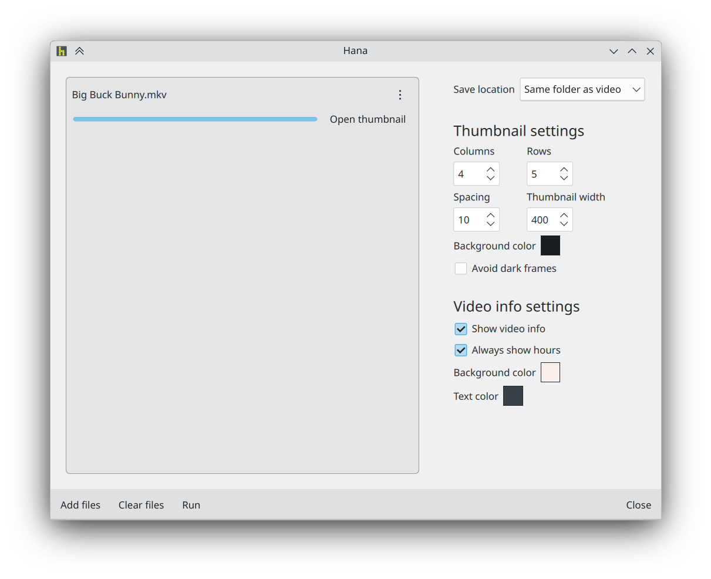

# Hana

An app to create thumbnails images from video files.

#### Donate: [GitHub Sponsors](https://github.com/sponsors/g-fb) | [Liberapay](https://liberapay.com/gfb/) | [PayPal](https://paypal.me/georgefloreabanus)



# Dependencies

Dependencies will be printed by `cmake` when building.

# Build

```bash
cmake -B build -G Ninja
cmake --build build
```
